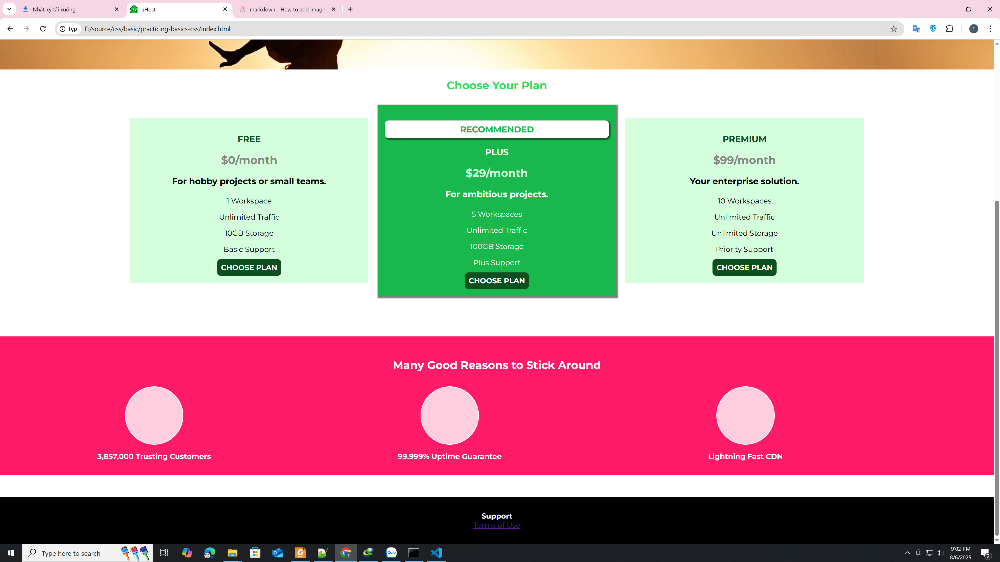
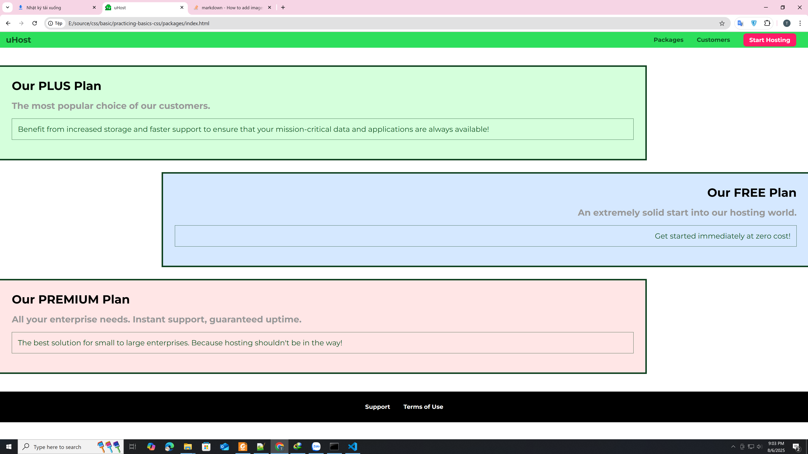

# uHost Landing Page

This project is a simple static website for the fictional hosting provider **uHost**. It demonstrates basic HTML and CSS layout and styling techniques, including navigation, responsive plans, and feature highlights.

## Project Structure

```
favicon.png
freedom.jpg
index.html
main.css
shared.css
packages/
    index.html
    packages.css
```

- **index.html**: Main landing page for uHost.
- **main.css**: Styles for the main page.
- **shared.css**: Shared styles for headers, navigation, buttons, and footer.
- **favicon.png**: Site favicon.
- **freedom.jpg**: Hero image for the landing page.
- **packages/**: Contains the packages subpage and its styles.
    - **packages/index.html**: Packages page.
    - **packages/packages.css**: Styles for the packages page.

## How to Use

1. Clone or download the repository.
2. Open `index.html` in your browser to view the main page.
3. Navigate to `packages/index.html` for the packages overview.

## Customization

- Update images (`freedom.jpg`, `favicon.png`) as needed.
- Modify HTML and CSS files to change content or styles.

## License

This project is for educational purposes.